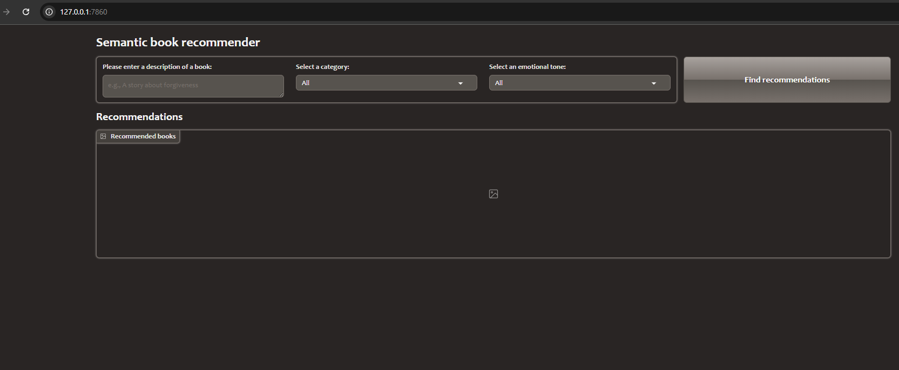
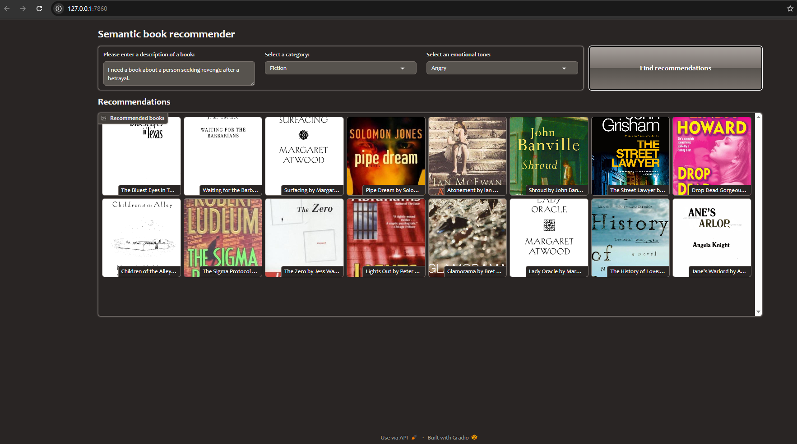
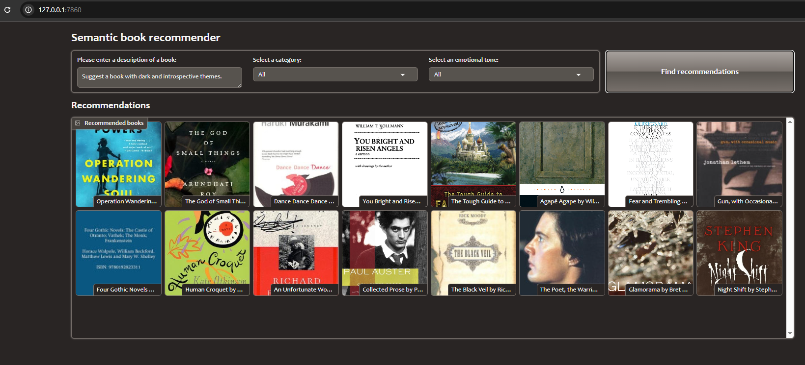

## Semantic Book Recommender Using LLMs



The LLM Semantic Book Recommender demonstrates how to build a semantic search system for book recommendations. The project utilizes pre-trained transformer models to generate vector embeddings from book metadata. By indexing these embeddings, the system efficiently returns recommendations that align with the user's search query—even if the phrasing does not match the dataset keywords directly.




## Features
**[Notebooks/Data_Preprocessing](Notebooks/Data_Preprocessing.ipynb)** Text data cleaning.This involved removing extraneous punctuation, stop words and normalizing text.


**[Notebooks/vector_search](Notebooks/vector_search.ipynb)** Semantic (vector) search and how to build a vector database. This allows users to find the most similar books to a natural language query (e.g., "a book about a person seeking revenge"). Text data (book descriptions) is converted to vector embeddings using pre-trained transformer model. This process captures the semantic meaning of the text.


**[Notebooks/text_classification](Notebooks/text_classification.ipynb)** Doing text classification using zero-shot classification in LLMs. This allows us to classify the books as "fiction" or "non-fiction", creating a facet that users can filter the books on.


**[Notebooks/Sentiment_Analysis](Notebooks/Sentiment_Analysis.ipynb)** Doing sentiment analysis using LLMs and extracting the emotions from text. This will allow users to sort books by their tone, such as how suspenseful, joyful or sad the books are.


**[gradio_dashboard](gradio_dashboard.py)** Creating a web application using Gradio for users to get book recommendations .


## Installation

1. **Clone the Repository:**

```bash
git clone https://github.com/KimathiNewton/llm_book_recommender.git
cd llm_book_recommender
```

```bash
python -m venv venv
source venv/bin/activate  # On Windows use: venv\Scripts\activate
```
Install Dependencies:

```bash
pip install -r requirements.txt
```
### Usage
The repository includes a Gradio-based dashboard to interact with the recommender system. To launch the dashboard, run:

```bash
python gradio_dashboard.py
```
This command will start a local web server. Open the provided URL in your browser and follow the instructions to input your preferences and see book recommendations.
